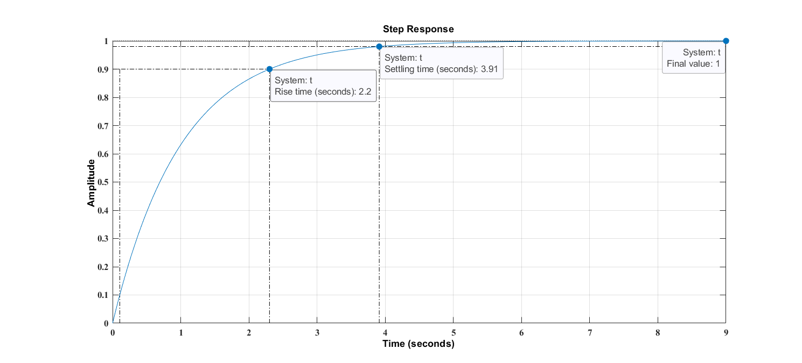

<strong>Theory:</strong>A first order system is one in which highest power of ‘s’ in denominator if transfer function defines order of the system.
					 For first order system,
					$${\frac{C(s)}{R(s)}=\frac{1}{sT+1}}$$ ...... (1), 
					$${C(s)=\frac{1}{sT+1}R(s)}$$
					<ol>
						<strong><li><em>For the unit-step input:</em></li></strong>
						 R(t)=1, R(s)=1/s (a), 
						Since the Laplace transform of the unit step function is 1/s , substituting R(s)=1/s in equation (1),
						$${\frac{C(s)}{R(s)}=\frac{1}{sT+1}\frac{1}{s}}$$ 
						Substitute the value of R(s) 
						Expanding C(s) into partial fractions gives,
						$${\frac{C(s)}{R(s)}=\frac{1}{s}-\frac{1}{sT+1}}$$...... (2), 
						$${\frac{C(s)}{R(s)}=\frac{1}{s}-\frac{1}{s+(\frac{1}{T})}}$$
						Taking the inverse Laplace t+-ransform of equation (2),we get, 
						C(t) = 1- e-t/T for t ≥ 0 ...... (3), 
						Equation (3) shows that initially (when t=0), the output C(t) is zero and finally (t→∞) e-t/T is zero and the output C(t) becomes unity. 
						 
						At t=T,&emsp;&emsp; C(t) = 1 – e-1 = 1 – 0.368 = 0.632, 
						That’s , the output response has reached 63.2 % of it’s final value . T is known as the time constant. Thus, the time constant T is defined as the time required for the output response to attain 63.2% of its final value or steady state value. 
						Equation (3) shows that the response curve is exponential in nature as shown on figure:
						 
						
						<strong><li><em>For the unit-impulse input:</em></li></strong> 
						Response of the first order system with unit impulse response:
						 
						For the unit-impulse input 
						R(s) = 1
						 
						 $${C(s) =\frac{1}{sT+1}R(s)}$$ ...... (1),
						 
						Subsituting the value of R(S) = 1 in equation (1), we get
						 
						$${C(s) =\frac{1}{sT+1}}$$
						$${C(s) =\frac{1}{T}\frac{1}{s+\frac{1}{T}}}$$ ...... (2), 
						Taking the inverse laplace transform of the equation of (2), we get the output response as
						$${C(s) = \frac{1}{T}e^\frac{-t}{T}}$$ for t >= 0 ...... (3), 
						The output response curve is shown below in the figure: 
						
					</ol>
